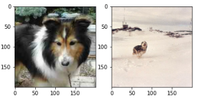
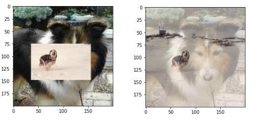
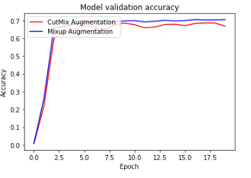
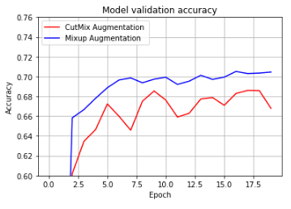

###  CutMix vs Mixup
I compared CutMix and MixUp Augementation.
In addition, compared  Augmentation using tf.image and No Augmentation.

- CutMix, MixUp, No Augementation, Augementation [used tf.image]를 사용해서 비교를 진행해 봤습니다.  
이 git의 메인은 No Augementation, Augementation [used tf.image]가 아닌 CutMix와 MixUp이라 판단해서 해당 내용을 중심으로 jupyter notebook를 작성했습니다.

일반적인 좌우 반전, 이미지 밝기 조정, center_crop 등의 방식은 많은 분들이 아실 내용이고 상대적으로 사용하기 더 간단해서 CutMix, MixUp Augementation을 중점으로 비교를 진행했습니다.

사용된 데이터 셋은 tensorflow datasets의 **'[stanford_dogs](https://www.tensorflow.org/datasets/catalog/stanford_dogs)'** 입니다.

- 예시 이미지로 아래의 두 이미지를 cutmix, mixup 하겠습니다. 

#### original image 

---

#### CutMix image [left] , MixUp image [right]
왼쪽이 위의 이미지를 CutMix한 이미지이고 오른쪽이 MixUp한 이미지 입니다. 

---

#### CutMix, MixUp val accuracy
Epoch 20일때 CutMix와 MixUp의 val_accuracy 

---
#### CutMix, MixUp val accuracy scale up

위의 그래프에서 val_acc가 (0.6, 0.76)인 지점만 따로 뽑아서 보겠습니다. 

특정 구간만 뽑아서 보니 결과가 좀 더 선명하게 보이네요.   

여기서 의문점이 들수도 있는데 CutMix가 ImageNet 등에서 더 좋은 성능을 보였는데 위의 결과는 왜 그러냐? 잘못된거 아니냐 라고 생각이 들 수 있습니다.
여기서 다시 위의 Augementation된 이미지들을 살펴보면 MixUp야 두 그림의 가중치 문제니 넘어간다 해도 CutMix 이미지를 보면 개보다 배경 부분이 좀 더 눈에 잘 띈다고 생각되지 않나요? CutMix를 랜덤으로 줘서 그런지 개라고 판단하기 가장 좋은 feature인 얼굴 부분에  Mix된 이미지가 들어갔고 들어간 이미지도 잘 보면 배경이 더 많은 비율을 차지한걸 볼 수 있습니다.

이 부분에서 CutMix가 어떤 데이터셋이 주어져도 MixUp보다 더 좋은 성능을 보이진 않는다고 판단을 했습니다.  

위에서 CutMix가 성능이 안좋게 된 이유를 말하라 하면,
1. 두 이미지에 있는 분류하고자 하는 클래스(개, dog)의 이미지 크기가 제각기 다릅니다.
   - 왼쪽에 있는 개의 이미지는 배경보다 개가 가지는 pixel 정보가 더 많지만, 오른쪽은 반대로 배경이 훨씬 더 크네요.

2. 1에서 생긴 문제로 발생된 추가적인 문제로 배경 부분이 더 많은 Mix 이미지가 기존 이미지의 주요한 feature를 가리는 문제입니다.  
   - 그 결과 기존의 배경보다 개의 pixel 정보가 더 많았던 이미지에서 배경이랑 개의 pixel 정보가 비슷한 이미지로 바뀌었고 주요하다 볼 수 있는 부분도 배경으로 가려졌기에 오히려 성능이 더 안좋게 나온것 같습니다.  
   
- 기존 데이터가 깔끔한 이미지만 있는것이 아니었으며, cutmix를 할 bounding box를 랜덤으로 crop 해서 위와 같이 안좋은 성능을 보인것 같네요.

Epoch 20으로 적게 돌렸지만, 위의 결과만 놓고 봤을때 모든 데이터의 대해서 **CutMix > MixUp**가 아니고 데이터와 Epoch 등의 따라서 **MixUp >= CutMix**가 될 수도 있다는 것을 알게된것 같습니다.  

- 추가로, 데이터의 중요함도 알게 됐습니다. 
